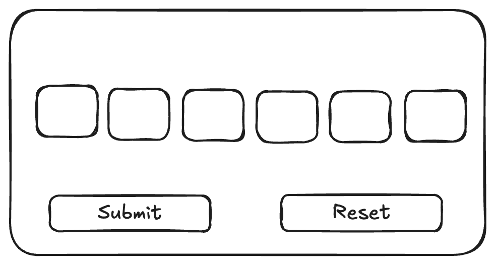

# Authorization code component Story

**Component name**

AuthCodeInput (6-digit OTP)

## Summary
AuthCodeInput is a 6-digit authorization code input used for 2FA-style flows. It renders six single-character fields,
plus Submit and Reset actions, and integrates with a backend (or mock) to validate the entered code.

## User story

As a user, I want to enter a 6-digit authorization code and submit it, so that I can verify my identity in a familiar
2FA-style flow.

## When to use
Verifying a user via SMS/email codes.
Sensitive actions that require an extra confirmation step.
Anywhere a short-lived, 6-digit code must be entered.
Anatomy
6 input fields aligned in a row (single character per field).
Primary action: Submit.
Secondary action: Reset.
Status message area (success / error / loading feedback).
Core behavior
Inputs
Each of the 6 fields accepts a single character.
Only digits 0–9 are allowed; non-digits are ignored.
Typing a valid digit:
Stores the digit in the current field.
Automatically focuses the next field (except from the 6th).
Backspace:
If current field has a value, clear it and keep focus.
If current field is empty, move focus to the previous field (if any) and clear it.
Pasting into any field:
Clears all 6 fields.
Extracts digits from the pasted text (ignores non-digits).
Fills from left to right.
Focus ends on the last filled field (or the 6th if more than 6 digits are pasted).
OTP completeness:
The component considers the value “complete” only when all 6 fields are filled with digits.
The final OTP string is the concatenation of all 6 field values.
Buttons
Submit:
Enabled only when the OTP is complete.
Disabled when any field is empty or while a submission is in flight.
Reset:
Enabled when at least one field has a value.
Disabled when all fields are empty.
On click, clears all 6 fields and focuses the first field.
API contract (mock for story/demo)
When the user submits (either by clicking the button or pressing Enter if enabled), generate a mock promise.
Body:
{ "otp": "6_DIGIT_OTP" }
Mock behavior in this story:
If otp === "123456":
Return HTTP 204.
Show a success message (e.g. “Code verified successfully.”).
Otherwise:
Return HTTP 403.
Show an error message (e.g. “Invalid code. Please try again.”).
Submitting state
While the request is in-flight:
Submit is disabled.
A simple loading state is shown (spinner or “Verifying…” label).
After response:
Loading is cleared.
On success: show success message; either keep or clear inputs (define and keep it consistent).
On error: show error message and keep inputs editable; Submit remains enabled if the OTP is still complete.
Accessibility
Provide a clear label and/or instructions (e.g. “Enter your 6-digit verification code”).
Ensure logical focus order across all 6 fields and buttons.
Visible focus indicators for keyboard users.
Status messages should be announced to assistive technologies (e.g. ARIA live region).
The implementation must not expose the accepted OTP (“123456”) in UI text or logs.
Design guidelines
Inputs should visually read as a group (consistent spacing, same width).
Use standard error and success styles from the design system for messages.
Keep the layout compact to work well in dialogs, modals, and full pages.

